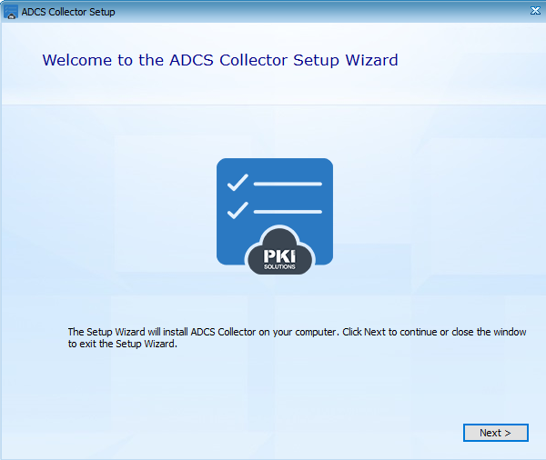
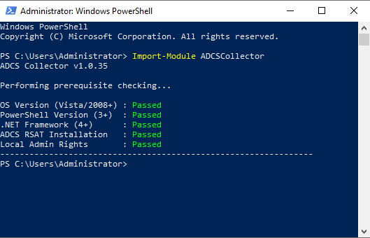

Genomlysning av PKI
===================

Detta dokument beskriver hur du gör en genomlysning av ditt PKI-system med hjälp av verktyget *ADCS Collector* från PKI Solutions.

Om du kör verktyget på en domänansluten maskin så kommer den automatiskt att detektera och genomlysa alla AD CS-servrar registrerade i Active Directory.

Om din miljö innehåller en så kallad *standalone CA* (dvs en AD CS-server som inte är ansluten till någon domän) så kommer du behöva köra verktyget flera gånger, minst en gång på en domänansluten maskin och en gång för varje AD CS-server med en standalone CA installerad.

Hantering av data
-----------------

Verktyget *ADCS Collector* samlar in information om hur ert PKI-system är konfigurerat, det samlar *inte* in några lösenord, privata nycklar eller kontodetaljer.

ADCS Collector krypterar informationen och den kan endast läsas på den analysportal som PKI Solutions tillhandahåller åt Atea. Analysportalen ligger på en dedikerad Azure-instans och inställningarna *Allow PKI Solutions to view and manage your organization* samt *Allow storage of ADCS Collector files* är inaktiverade för att säkerställa att endast Atea kan komma åt datat. Mer information finns på [PKI Solutions webbsida](https://www.pkisolutions.com/assessment-data-protection).

Instruktioner
-------------

1. Ladda ner filen ``ADCS Collector-v1.0.35.exe`` som du erhåller från Atea, och överför filen till AD CS-servern som du vill genomlysa.

2. Logga in på AD CS-servern som enterprise admin om du gör en genomlysning av en eller flera domänanslutna AD CS-servrar, eller som lokal administratör om du gör en genomlysning av en standalone CA.

3. Dubbeklicka på filen ``ADCS Collector-v1.0.35.exe`` och följ installationsguiden.



4. Öppna PowerShell och kör följande kommando för att importera ADCSCollector-modulen.
```
    Import-Module ADCSCollector
```

När modulen importeras så görs en systemkontroll. Åtgärda eventuella problem innan du fortsätter till nästa steg.



5. Kontrollera vilka AD CS-servrar som finns i Active Directory.
```
    Get-AdcsServerList
```

Fortsätt till kapitlet *Genomlys en CA-hierarki* om du har en CA-hierarki (dvs en eller flera certifikatutfärdare signerade av samma rotutfärdare) eller *Genomlys flera CA-hierarkier* om du har mer än en CA-hierarki.

Genomlys en CA-hierarki
-----------------------

1. Genomför genomlysningen av alla AD CS-servrar som listades i föregående steg och spara resultatet i mappen ``C:\AdcsCollector``.
```
    Start-AdcsCollector
```

När verktyget har kört klart, kommer den skriva ut meddelandet "Data collection completed".

Genomlys flera CA-hierarkier
----------------------------

Om du har mer än en CA-hierarki måste du köra verktyget flera gånger, en gång för varje CA-hierarki.

I nedanstående exempel har vi tre utfärdare, *Sub CA A*, *Sub CA B* och *Sub CA C*, där *Sub CA A* och *Sub CA B* är signerade av en rotutfärdare och *Sub CA C* är signerad av en annan rotutfärdare. Om vi kör ``Get-AdcsServerList`` på ``server01-example.com`` kommer vi att se något i stil med:
```
    PS> Get-AdcsServerList
    ServerName         : server01.example.com
    CAName             : Sub CA A
    SanitizedName      : Sub CA A
    SanitizedShortName : Sub CA A
    ConfigString       : server01.example.com\Sub CA A
    Source             : DsEntry, Registry, Local
    DomainID           :
    Succeed            : False

    ServerName         : server02.example.com
    CAName             : Sub CA B
    SanitizedName      : Sub CA B
    SanitizedShortName : Sub CA B
    ConfigString       : server02.example.com\Sub CA B
    Source             : DsEntry
    DomainID           :
    Succeed            : False

    ServerName         : server03.example.com
    CAName             : Sub CA C
    SanitizedName      : Sub CA C
    SanitizedShortName : Sub CA C
    ConfigString       : server03.example.com\Sub CA C
    Source             : DsEntry
    DomainID           :
    Succeed            : False
```

De motsvarande kommandona blir då:
```
    Start-AdcsCollector -Include "server01.example.com", "server02.example.com" -UseIncludeOnly
    Start-AdcsCollector -Include "server03.example.com" -UseIncludeOnly
```

1. Kör ``StartAdcsCollector`` upprepade gånger med flaggorna ``-Include`` och ``-UseIncludeOnly`` enligt exemplet ovan.

Efter varje körning kommer verktyget att skriva ut meddelandet "Data collection completed".

Skicka resultatet till Atea
---------------------------

1. Öppna mappen ``C:\AdcsCollector\Reports\cab`` och dela alla filer som ligger i denna mapp med Atea.

